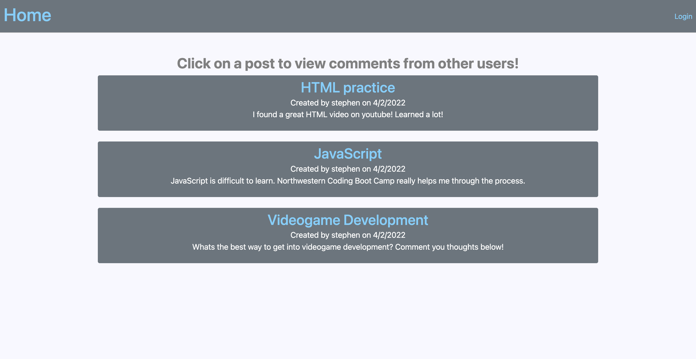

# model-view-controller 

## Table of Contents:

-   [Description](./README.md#description)
-   [License](./README.md#license)
-   [Contributing](./README.md#contributing)
-   [Screenshot](./README.md#screenshot)
-   [Links to Application](./README.md#links-to-application)
-   [Questions](./README.md#questions)

## Description

This is a model view controller application that represents a Tech Blog. Users are able to sign up/log in and can make posts that will display on the homepage of our website. From there a user can view all posts from the website and navigate into a post where they can create comments that every user will be able to view. if a user wants to take down their self created post they are able to delete it from their profile page.

## License

This software is licensed to MIT, for more information you may visit this link:
[MIT License Wikipedia](https://en.wikipedia.org/wiki/MIT_License)

## Contributing

If you wish to contribute to our content, please contact one of us at:

- smarr2198@gmail.com
## Screenshot

## Links to Application

-   Here is the repo: [https://github.com/TeamHBs/petrol-pirate](https://github.com/smarr2198/model-view-controller)
-   Here is the heroku: [https://hbs-project-two.herokuapp.com/](https://smarr-model-view-controller.herokuapp.com/)
## Questions

If you have any questions, you may contact:
#### Stephen Marr

- Email: smarr2198@gmail.com
- Github Profile: [https://www.github.com/smarr2198](https://www.github.com/smarr2198)

